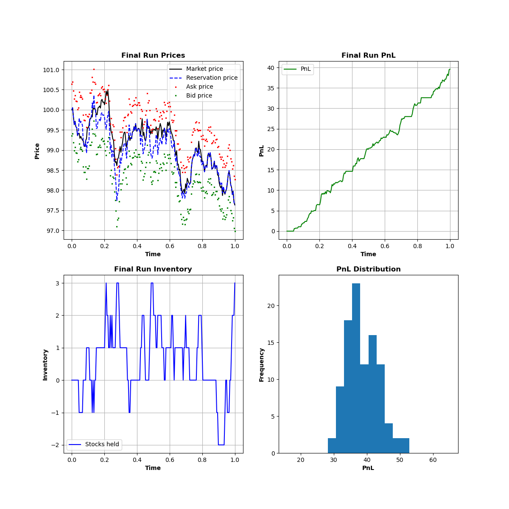

# Market-Making Algorithm Implementation
This project serves as a playground for implementing a market-making algorithm for High-Frequency Trading (HFT). The model currently implemented in this project is the Avellaneda-Stoikov model. The research paper by Avellaneda and Stoikov can be accessed [here](https://citeseerx.ist.psu.edu/document?repid=rep1&type=pdf&doi=93e392c5b2765e6691b8acb60cd4a7e975bf1d6a). 

## How to Run
Make sure to have both Python (e.g., version 3.12.3) and `pip` installed. Open the root directory of this project in your terminal and run the following command to install all required packages:

```sh
pip install -r requirements.txt
```

Next, to run the simulation, run the following command:
```sh
python src/main.py
```

## Result
The images below depict an example simulation run of the market maker.

